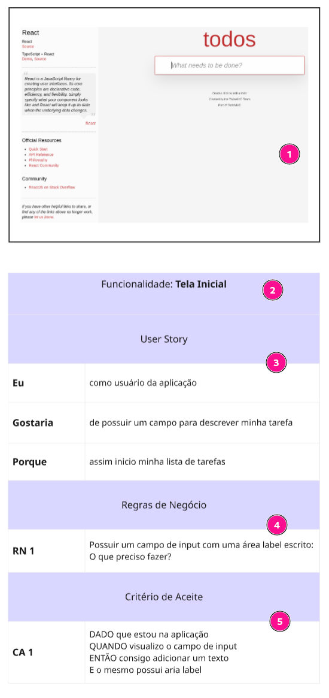

# Estudo de Caso de Teste – Projeto TodoMVC

Este projeto foi criado com o propósito de praticar o **levantamento de requisitos** e a **análise técnica** de um sistema. A proposta foi analisar um projeto do tipo checklist, retirado do site **TodoMVC**, que apresenta implementações em diversas linguagens, permitindo observar o comportamento da linguagem escolhida.

Com isso, apresento a análise do projeto **TodoMVC**, onde, por meio do site, identifiquei os requisitos desejáveis para esse tipo de aplicação.

## ✒️ Análise do Projeto
> A imagem abaixo ilustra como a análise deste projeto foi estruturada, utilizando a ferramenta **Miro** para representar visualmente os requisitos e funcionalidades identificadas.

  

## 📁 Estrutura da Pasta

- `evidencias/`: Contém capturas de tela organizadas por requisito, demonstrando a execução real dos testes.
- `img/`: Imagem da análise de refinamento e levantamento de critérios feita no Miro.
- `02-plano-de-teste.md`: Documento com objetivo, escopo, critérios de aceitação, rastreabilidade e ambiente de teste.
- `03-casos-de-teste.md`: Lista detalhada dos casos de teste com critérios de aceite, resultados esperados e status de execução.
- `04-evidencias-de-analise.md`: Lista algumas ilustrações da análise do caso de teste da aplicação TodoMVC.

## ✅ Escopo de Testes

Os testes contemplam as seguintes funcionalidades da aplicação TodoMVC:

- Tela inicial
- Inclusão de itens
- Filtros: Todos, Ativos, Concluídos
- Conclusão de tarefas (unitária e em lote)
- Exclusão de tarefas
- Limpeza de tarefas finalizadas

## 👩‍💻 Tecnologias e Ambiente

- Navegador: Microsoft Edge 134.0.3124.83 (64 bits)
- Tipo de Teste: Funcional manual
- Protótipo base: [https://todomvc.com/examples/react/](https://todomvc.com/examples/react/dist/)

## 📌 Observações

- Todos os testes foram baseados nos **Critérios de Aceite** definidos na análise de requisitos.
- A execução considerou priorização por risco (severidade e impacto para o usuário).

### ✅ Status Geral dos Testes

- Plano de Teste: ✅ Finalizado  
- Casos de Teste: ✅ Finalizado  
- Execução dos Testes: ✅ Concluída  

## 👩‍💻 Responsável

- **Analista de Teste:** Fabrícia Fernandes  
- **E-mail:** fabriciaqa@gmail.com 

## 📅 Período de Execução

- **Data de Início:** 29/05/2025  
- **Data de Término:** 29/05/2025  

## 📌 Referência

- Plano de Teste v1.0

## 📄 Documentação de Testes

  - 🔹 [Plano de Teste ](./02-plano-de-teste.md)
  - 🔹 [Casos de Teste ](./03-casos-de-teste.md)
