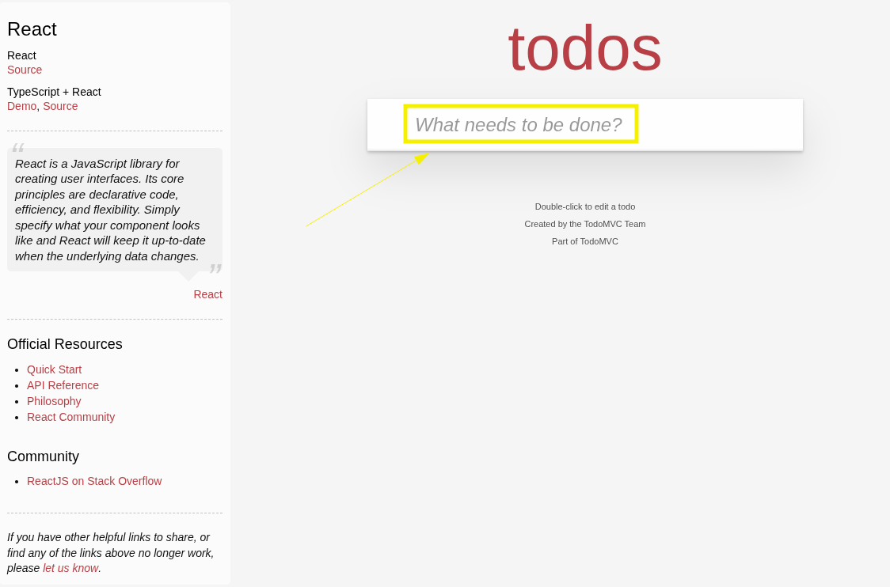
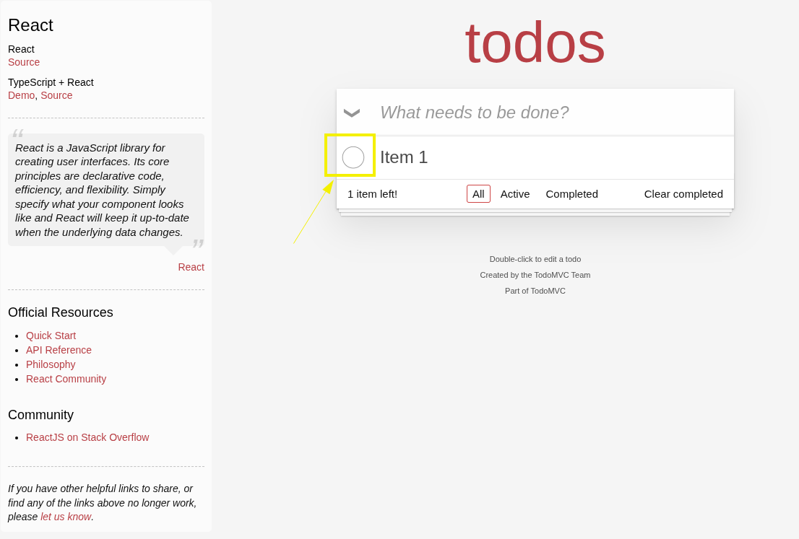
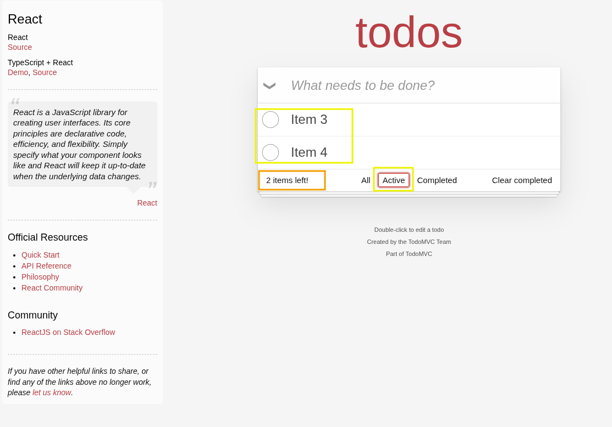
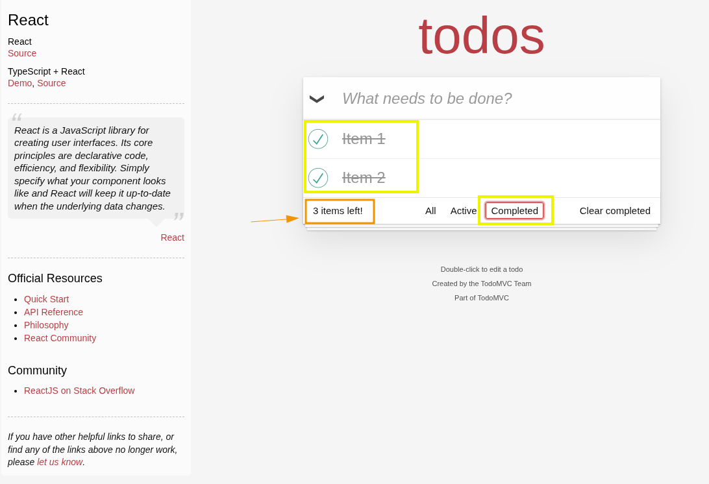

<h1 align="center">Evidências de Análise – TodoMVC</h1>

## Evidências de Análise

- Verificação de campos obrigatórios, como a tentativa de criar uma nova tarefa sem texto:

    

- Testes de comportamento de entrada de dados: limite de caracteres, entrada vazia e espaços em branco:

    

- Testes de regressão em funcionalidades como edição, exclusão e filtragem de tarefas:

    

- Validação de persistência e consistência dos dados entre ações do usuário e o estado da interface (ex: marcação de tarefa como concluída):

    

- Ambiente de testes utilizado: [https://todomvc.com/examples/react/dist/](https://todomvc.com/examples/react/dist/)
- Evidência visual capturada com Flameshot e documentação elaborada em Markdown.