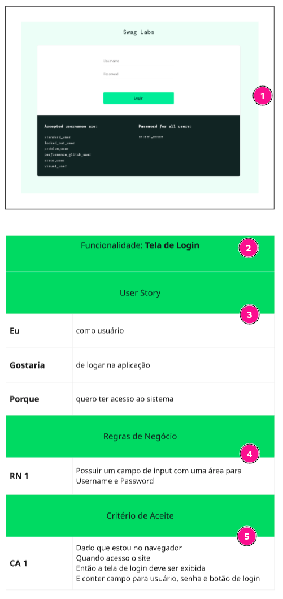

# Estudo de Caso de Testes – Projeto Swag Labs

Este repositório reúne o **Plano de Teste**, **Casos de Teste** e o **Controle de Defeitos** elaborados para a aplicação **Swag Labs**, com foco na validação funcional da plataforma em um cenário simulado de e-commerce.

[Swag Labs](https://www.saucedemo.com/v1/index.html)

## ✒️ Análise do Projeto
> A imagem abaixo ilustra a estrutura da análise realizada, utilizando a ferramenta **Miro** para mapear visualmente os requisitos, fluxos de navegação e funcionalidades relevantes da aplicação.

  

1. **Imagem de Referência**: Captura da interface do sistema **Swag Labs**, utilizada como base para análise funcional.  
2. **Funcionalidade Selecionada**: Identificação da funcionalidade da aplicação que será alvo dos testes.  
3. **Descrição Funcional de Alto Nível**: Explicação breve sobre o fluxo da funcionalidade, incluindo o tipo de usuário, a ação realizada e o objetivo que ela atende no contexto do sistema.  
4. **Regras de Negócio**: Relação das regras que definem como a funcionalidade deve se comportar, conforme os requisitos esperados.  
5. **Critérios de Aceite**: Conjunto de condições que precisam ser cumpridas para garantir que a funcionalidade está implementada corretamente e atende aos objetivos definidos.

## 📌 Objetivo

Validar o comportamento das principais funcionalidades do sistema Swag Labs, com base no plano de testes proposto. O objetivo é verificar a conformidade com os requisitos esperados, identificar possíveis falhas e registrar as evidências e inconsistências encontradas durante a execução dos testes.

## 📁 Estrutura da Pasta

- `evidencias/`: Contém pastas organizadas por Requisitos (REQ), com imagens dos testes realizados.
- `img/`: Imagem da análise de refinamento do plano de teste.
- `02-plano-de-teste.md`: Documento com escopo, objetivo, critérios de aceitação e rastreabilidade dos testes.
- `03-casos-de-teste.md`: Casos de teste detalhados com pré-condições, critérios, resultados esperados e obtidos.
- `04-controle-de-bugs.md`: Relatório de defeitos encontrados durante a execução dos testes.

## 🧪 Funcionalidades Testadas

Todas as funcionalidades especificadas nos requisitos funcionais do sistema, com foco especial em:

- Login
- Menu e navegação
- Carrinho (adicionar/remover itens)
- Filtros de produtos

## 🧪 Ferramentas utilizadas

- Navegador: Microsoft Edger e Google Chrome
- Plataforma de testes: Manual
- Documentação: Excel, Markdown
- Análise de refinamento: Miro

### ✅ Status Geral dos Testes

- Plano de Teste: ✅ Finalizado  
- Casos de Teste: ✅ Finalizado  
- Execução dos Testes: ✅ Concluída  
- Controle de Defeitos: ✅ Atualizado

## 👩‍💻 Responsável

- **Analista de Teste:** Fabrícia Fernandes  
- **E-mail:** fabriciaqa@gmail.com  
- **Ponto Focal:** @fabricia.fernandes  

## 📅 Período de Execução

- **Data de Início:** 03/06/2025  
- **Data de Término:** 03/06/2025  

## 📝 Observações

- Testes executados com usuários padrões fornecidos pela aplicação.  
- Os defeitos estão documentados com base nos critérios de aceitação definidos no plano.

## 📌 Referência

- Plano de Teste v2.0

## 📄 Documentação de Testes

- 🔹 [Plano de Teste](./02-plano-de-teste.md)
- 🔹 [Caso de Teste](./03-casos-de-teste.md)
- 🔹 [Controle de Bugs](./04-controle-de-bugs.md)