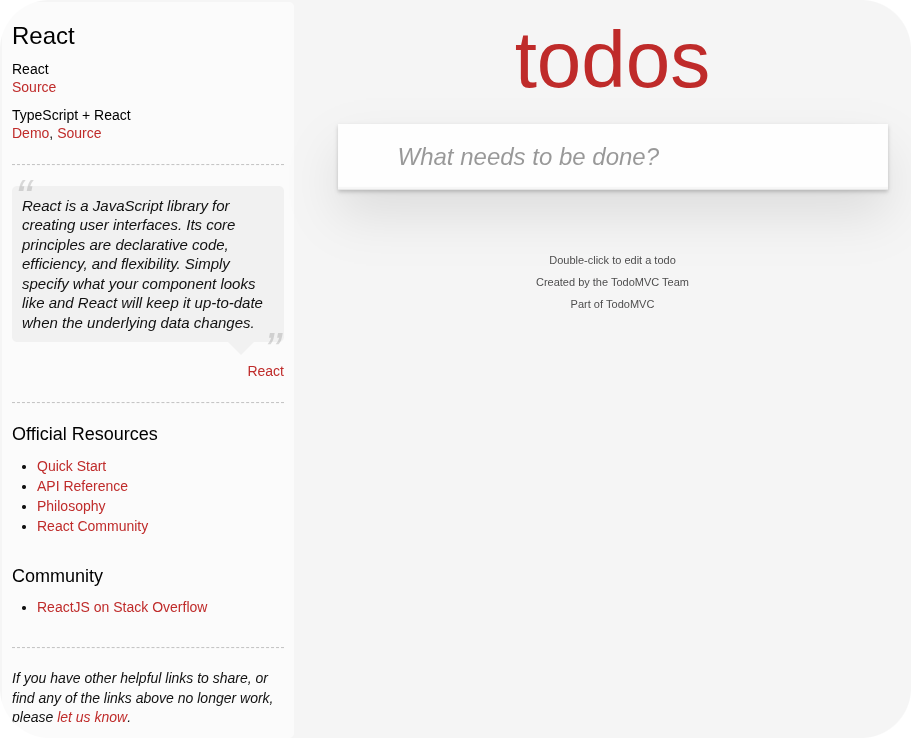
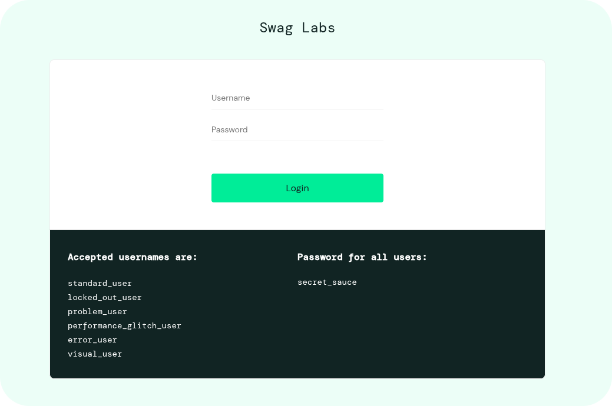

# Portfólio de Qualidade de Software

Este repositório tem como propósito evidenciar minha experiência em projetos práticos de estudo de caso, realizados na área de Garantia da Qualidade de Software (QA), com foco em **testes manuais e funcionais**.

Neste repositório, você encontrará **planos de teste**, **casos de teste**, **análises de requisitos**, **relatórios de bugs** e **evidências**, aplicados em cenários reais, como:

- Um site de checklist;
- E um site de e-commerce.

## 🖇️ Índice

- [Tecnologias e Ferramentas Utilizadas](#tecnologias-e-ferramentas-utilizadas)
- [Metodologias e Práticas de QA](#metodologias-e-praticas-de-qa)
- [Projetos Inclusos](#projetos-inclusos)
  - [Site de Checklist](#site-de-checklist)
  - [Site de E-commerce](#site-de-e-commerce)
- [Documentação de Testes](#documentacao-de-testes)
- [Pessoa Autora](#pessoa-autora)
    - [TodoMVC](tudomvc)
    - [Swag Labs](swag-labs)

## 🔧 Tecnologias e Ferramentas Utilizadas

- Para estes estudos de caso, utilizei:
    - **Testes Manuais** (funcionais e regressivos)
    - **Miro** – análise de requisitos / upstream
    - **Metodologias Ágeis** – Scrum
    - **Microsoft Excel** – planilhas de apoio (.xlsx)
    - **Markdown** – documentação técnica (.md)
    - **Flameshot** – capturas de tela e anotações para evidências de teste
    - **Visual Studio Code (VS Code)** – editor de texto e análise de código
    - **GIMP** – editor de imagens.

## 🛠️ Metodologias e Práticas de QA

- Apliquei as seguintes estratégias de estudo:
    - **Metodologia Ágil (Scrum)**: participação em sprints, planejamento de entregas e retrospectivas.
    - **Behavior Driven Development (BDD)**: desenvolvimento orientado por comportamento, com foco na colaboração entre times de negócio e desenvolvimento.
    - **Gherkin & Cucumber**: escrita de cenários de teste em linguagem natural para facilitar o entendimento.
    - **Estratégias de Teste**: definição do escopo, tipos de teste (funcional, regressão, exploratório), priorização e análise de risco.
    - **Técnicas de Teste**: aplicação de técnicas como particionamento de equivalência, testes baseados em requisitos e testes exploratórios.
    - **Rastreabilidade**: garantia da ligação entre requisitos, casos de teste e evidências para assegurar cobertura e controle de qualidade.

## 📂 Projetos Inclusos

### 1. Site de Checklist

- Site utilizado para estudo de caso: ✅ [**TodoMVC**](https://todomvc.com/examples/react/dist/)

  

---

### 2. Site de E-commerce

- Site utilizado para estudo de caso e criação de relatórios de bugs: 🛒 [**Swag Labs**](https://www.saucedemo.com/)

  

## 📄 Documentação de Testes

Nesta seção, você encontrará os documentos elaborados para cada projeto estudado, com foco nas práticas de Garantia da Qualidade de Software (QA). Cada conjunto de arquivos inclui:

- Leitura inicial do projeto (README)
- Plano de Testes detalhado
- Casos de Teste organizados
- Evidências e controle de bugs (quando aplicável)

### 📝 TodoMVC

- 🔹 [README](./01-todomvc-react/01-README.md)
- 🔹 [Plano de Teste](./01-todomvc-react/02-plano-de-teste.md)
- 🔹 [Casos de Teste](./01-todomvc-react/03-casos-de-teste.md)

### 🛍️ Swag Labs

- 🔹 [README](./02-salsidemo/01-README.md)
- 🔹 [Plano de Teste](./02-salsidemo/02-plano-de-teste.md)
- 🔹 [Casos de Teste](./02-salsidemo/03-casos-de-teste.md)
- 🔹 [Controle de Bugs](./02-salsidemo/04-controle-de-bugs.md)

## ✒️  Pessoa Autora

<a href="https://www.linkedin.com/in/fabriciafernandes/">
  

    
     
    <strong>Portfólio de **Fabrícia Fernandes**, com 💙</strong>
  

</a>

  
  

<strong>✍️ Repositório em evolução contínua. Feedbacks e sugestões são bem-vindos!</strong>
